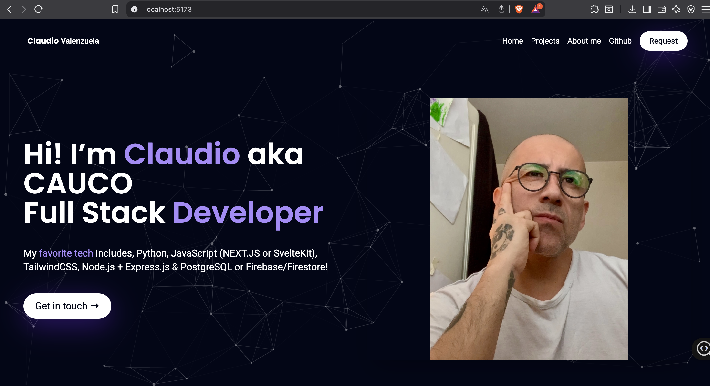
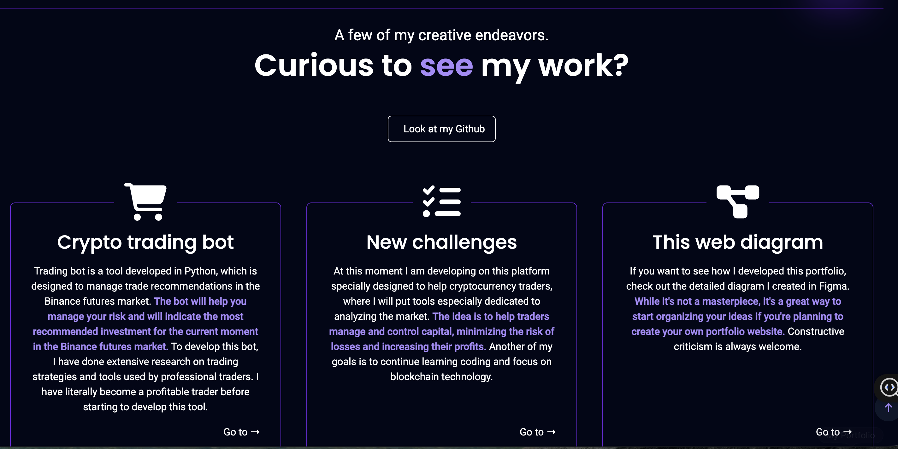
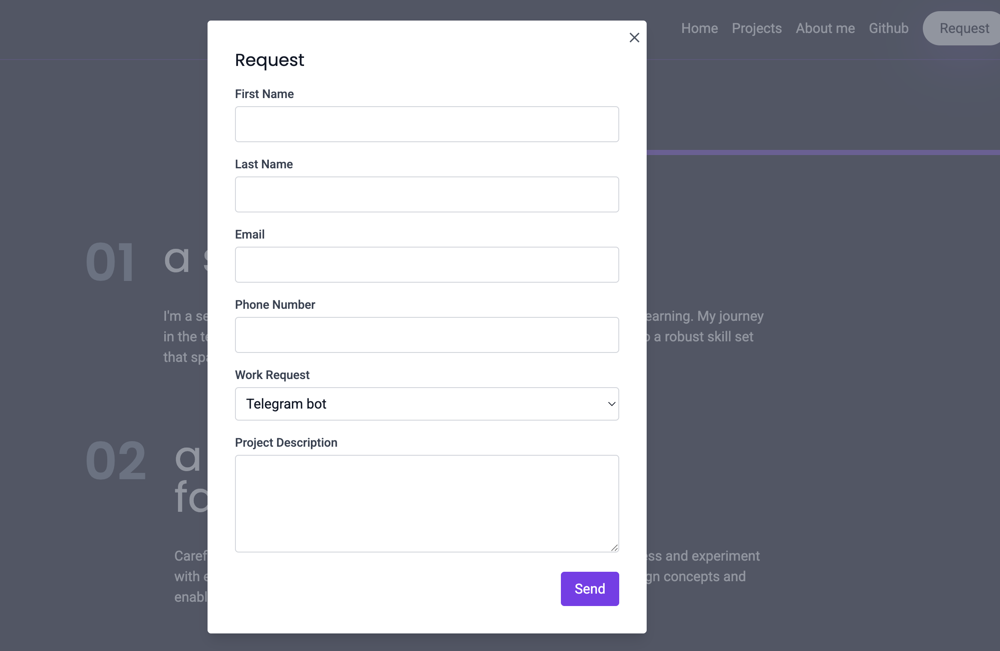

# My Portfolio
---

A personal portfolio website showcasing my skills, projects, and experience in full-stack web development, with a strong focus on SvelteKit and TailwindCSS. This project serves both as a professional presentation of my work and as a technical playground for experimenting with modern frontend and backend tools.

---
## Table of Contents
---

- Overview
- Features
- Screenshots
- Technologies
- Setup & Installation
- Usage
- Architecture / Integrations
- Supervisor Configuration
- JSON Configuration Files
- Project Structure
- Contributing
- Contact
- License
- Resources
- Restart Instructions
- Troubleshooting

---
## Overview
---

This portfolio highlights my experience in full-stack development, UI/UX design, and technical problem-solving. It includes selected projects such as cryptocurrency analysis tools, experimental visualizations, and supporting backend services, all designed to demonstrate clean architecture, maintainability, and real-world development practices.

---
## Features
---

- Responsive UI for desktop, tablet, and mobile  
- Project showcase with technical context and implementation details  
- Modal-based contact and request flow for collaboration inquiries  
- Crypto and trading tools with market indicators and visualizations  
- RSI heatmap visualization for real-time data display  

---
## Screenshots
---

### Home
Landing page presenting my profile, core technologies, and primary navigation.



---

### About Me
Section describing my background, learning journey, and interests in software development and user experience.


---

### Projects
Overview of selected projects, including crypto-related tools and experimental applications.



---

### Contact / Request
Modal-based contact form that allows visitors to submit collaboration or project requests.



---
## Technologies
---

### Frontend
- SvelteKit  
- TailwindCSS  

### Backend
- Node.js  
- Express.js  
- Flask (Python)  

### Infrastructure & Tooling
- Docker  
- Git & GitHub  
- Netlify / Railway  

---
## Setup & Installation
---

Clone the repository and install dependencies:

```bash
git clone https://github.com/CAUCORASEKO/My_portfolio.git
cd My_portfolio
npm install --legacy-peer-deps
```

## Start the development server

~~~bash
npm run dev
~~~

---

## Access the application

- Svelte application: http://localhost:5173

---

## Usage

- Navigate the site to explore Projects, About Me, and other sections.
- Crypto Trading Bot: access via the provided Telegram link.
- Tools page: use tools for analyzing the cryptocurrency market.
- RSI Heatmap: available at http://localhost:5173/tools

---

## Architecture / Integrations

### RSI Heatmap Integration

The RSI Heatmap feature is integrated into the Tools section of the portfolio. It leverages a Flask backend to generate real-time heatmaps of the Relative Strength Index (RSI) for top cryptocurrencies.

### Backend Deployment

The RSI heatmap backend is deployed using Flask and hosted on Railway. The backend generates the RSI heatmap image, which the Svelte frontend fetches and displays.

### Frontend Integration

In the `tools.svelte` file, a fetch request is made to the deployed backend to retrieve the heatmap image. The image is then dynamically displayed in the Svelte application.

### CORS Configuration

Cross-Origin Resource Sharing (CORS) is enabled in the Flask backend to allow requests from the Svelte frontend.

### Modifications

The original RSI heatmap code was adapted to fit deployment requirements:

- Path adjustments for saving and serving the image on Railway
- CORS headers added in the Flask backend

### Credit

The RSI heatmap implementation is based on the work of Stephan Akkerman.

---

## Supervisor Configuration

This project uses supervisord to manage and monitor both the Svelte frontend and the Flask backend processes. Supervisor ensures that each service starts automatically, restarts on failure, and produces structured logs.

### supervisord.conf configuration

~~~ini
[supervisord]
nodaemon=true

[program:flask]
command=gunicorn -w 4 -b 0.0.0.0:5001 src.routes.tools.rsi_heatmap.main:app
directory=/app
autostart=true
autorestart=true
stderr_logfile=/var/log/flask.err.log
stdout_logfile=/var/log/flask.out.log

[program:svelte]
command=npm run preview -- --host 0.0.0.0
directory=/app
autostart=true
autorestart=true
stderr_logfile=/var/log/svelte.err.log
stdout_logfile=/var/log/svelte.out.log
~~~

---

### Explanation

- `nodaemon=true`: runs supervisord in the foreground for easier debugging.
- `command=gunicorn ...`: starts the Flask application with 4 workers on port 5001.
- `command=npm run preview ...`: starts the Svelte application in preview mode on all interfaces.
- `directory=/app`: sets the working directory for each process.
- `autostart=true`: starts each process automatically.
- `autorestart=true`: restarts on failure.
- `stderr_logfile` and `stdout_logfile`: log locations for each process.

### Usage

Start supervisord using this configuration in your Docker container or server to automatically manage the Svelte and Flask processes.

---

### Benefits

- Process management with automatic restarts
- Centralized logging
- Improved concurrency with Gunicorn workers

---

## JSON Configuration Files

### package.json

The `package.json` file defines the project details, manages dependencies, and scripts.

~~~json
{
  "name": "cauco",
  "version": "0.0.1",
  "private": true,
  "scripts": {
    "dev": "vite dev --host",
    "build": "vite build",
    "preview": "vite preview --host",
    "start": "node build",
    "start:railway": "vite preview --host 0.0.0.0 --port $PORT"
  },
  "devDependencies": {
    "@sveltejs/adapter-auto": "^2.0.0",
    "@sveltejs/kit": "^1.30.0",
    "autoprefixer": "^10.4.19",
    "postcss": "^8.4.39",
    "svelte": "^4.0.5",
    "tailwindcss": "^3.4.6",
    "vite": "^4.4.2"
  },
  "dependencies": {
    "@sveltejs/adapter-node": "^5.2.0",
    "chart.js": "^4.4.3",
    "mdn-data": "^2.9.0",
    "nodemailer": "^6.9.14"
  },
  "type": "module"
}
~~~

---

### Key Fields

- `name`: project name
- `version`: project version
- `private`: prevents accidental publish to npm
- `scripts`: available npm commands
- `devDependencies`: development-only dependencies
- `dependencies`: production dependencies
- `type`: ECMAScript module configuration

---

### Scripts in This Project

- `dev`: starts the Vite development server in host mode
- `build`: builds the production bundle
- `preview`: previews the production build
- `start`: starts the application with Node.js
- `start:railway`: runs preview with Railway port configuration

### package-lock.json

The `package-lock.json` file is generated by `npm install` and locks the exact versions of dependencies and sub-dependencies to ensure reproducible installs.

**It includes:**
- `version`: package-lock schema version
- `requires`: whether dependencies are required
- `dependencies`: resolved versions, integrity hashes, and sub-dependencies

This guarantees consistent dependency installation across all environments.

---

## Project Structure

~~~text
Project Root
├── src/
│   ├── components/
│   │   ├── Footer.svelte
│   │   ├── Header.svelte
│   │   ├── Main.svelte
│   │   ├── Modal.svelte
│   │   ├── modalStore.js
│   │   └── Step.svelte
│   ├── lib/
│   │   └── index.js
│   ├── routes/
│   │   ├── api/
│   │   │   └── contact.js
│   │   └── tools/
│   │       ├── rsi_heatmap/
│   │       │   ├── __pycache__/
│   │       │   ├── data.py
│   │       │   └── main.py
│   │       ├── cryptohunter.svelte
│   │       ├── news.svelte
│   │       ├── rsiheatmap.svelte
│   │       ├── +layout.svelte
│   │       └── +page.svelte
│   ├── app.css
│   ├── app.html
│   └── global.css
├── static/
│   ├── assets/
│   ├── images/
│   └── favicon.png
├── .env
├── .gitattributes
├── .gitignore
├── .hintrc
├── .npmrc
├── Dockerfile
├── package-lock.json
├── package.json
├── postcss.config.cjs
├── Procfile
├── README.md
├── requirements.txt
├── supervisord.conf
├── svelte.config.js
├── tailwind.config.cjs
├── tailwind.config.js
└── vite.config.js
~~~

## Contributing

Contributions are welcome 🙌  
Please fork this repository and submit a pull request for improvements or additions.

---

## Contact

**Claudio Valenzuela**  
📧 Email: claudio@aisosu.fi  
🔗 Project Link: https://github.com/CAUCORASEKO/My_portfolio

---

## License

This project is licensed under the **MIT License**.

---

## Resources

- TailwindCSS Guide  
- Google Fonts  
- Font Awesome CDN  
- Font Awesome Icons  
- Particles.js  

---

## Restart Instructions

Open a terminal and navigate to the project directory:

~~~bash
cd ~/Desktop/My_portfolio
~~~

Start Docker and ensure **Docker Desktop** is running.

Build the Docker image (if needed):

~~~bash
docker build -t my_svelte_app
~~~

Run the Docker container:

~~~bash
docker run -p 8081:4173 -p 5002:5001 my_svelte_app
~~~

Access the application:

- **Svelte application:** http://localhost:5173  
- **API (heatmap):** http://localhost:5002/heatmap  

---

## Troubleshooting

- Check Docker status and restart Docker Desktop if needed.
- Inspect container logs:

~~~bash
docker logs <container_id>
~~~

- Resolve port conflicts on **8081** or **5002**:

~~~bash
lsof -i :<port>
kill -9 <PID>
~~~